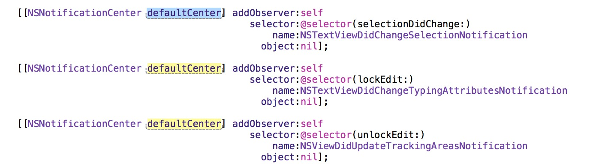

# Introduction
高亮显示所有与选中 字符串 相同的 字符串
 
 

# Important Update
修复引起Xcode crash 的bug。
# 特别感谢
<a href ="http://www.onevcat.com/2013/02/xcode-plugin/"> Xcode 4 插件制作入门 </a>  
<a href ="https://github.com/fortinmike/XcodeBoost"> XcodeBoost </a>  
<a href ="https://github.com/kattrali/Xcode-Plugin-Template"> Xcode6 插件模板 </a>  
<a href ="http://www.cnblogs.com/lvlin/archive/2013/09/24/3337332.html"> Xcode插件兼容多个版本 </a>  
